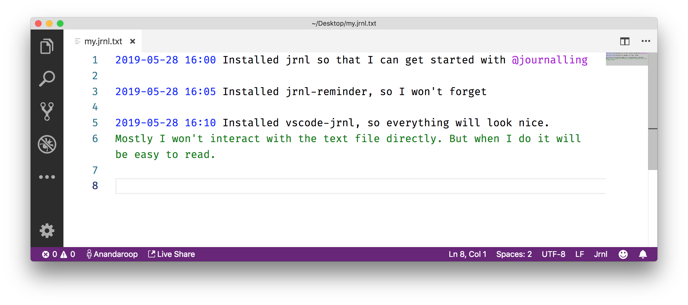

# VS Code extension for Jrnl

Simple syntax colorization for Jrnl's text file format.



Learn more about Jrnl at [Jrnl.sh](http://jrnl.sh)

## Installation

This is not published to the marketplace, so for now it's kind of manual:

- Find the [latest release](https://github.com/anandaroop/vscode-jrnl/releases/latest/)
- Download the `.vsix` file
- Install it with `code --install-extension <path to vsix file>`
- Relaunch VS Code

For example, the v0.0.42 release could be installed as follows:

```sh
# download
curl -L -O https://github.com/anandaroop/vscode-jrnl/releases/download/v0.0.42/jrnl-0.0.42.vsix

# install
code --install-extension jrnl-0.0.42.vsix
```


## Usage

- **Either**: Open your Jrnl file and use the [language picker](https://code.visualstudio.com/docs/languages/overview#_changing-the-language-for-the-selected-file) to choose "Jrnl"

- **Or**: avoid having to do this each time by renaming your Jrnl text file to something ending in `.jrnl.txt`, which will automatically be recognized by this extension.
